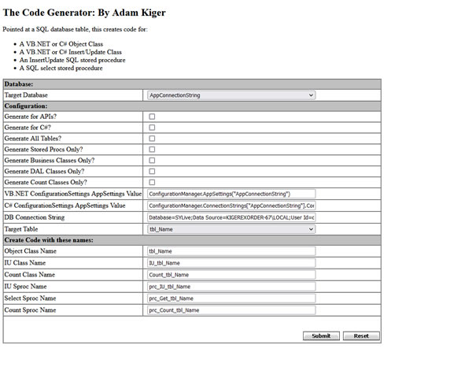

# ORM

  


## Introduction

20 years ago I began writing a tool to generate business classes, data access layer classes, insert/update/get stored procedures. I got so tired of writing the same code over and over again. As a developer, I can personally tell you that this is a common complaint among developers. Through the years I stuck to what worked easily and quickly since as a developer I'm constantly surrounded by impossible deadlines and the need for the reuse of successfully tested functionality which is crucial. As time passed I realized a similarity in the business classes, data access layer classes, insert/update/get stored procedures I was writing. As soon as portions of code in these categories passed various and rigorous testing from my wonderful friends in Quality & Assurance, I took the code and began looking for a way to speed up my development process.





The Code Generation Tool will allow the user to point to any SQL Server 2000/2005/2008/2016/2019/2022 Database and generate code on a per table basis or generate code on all the tables in that database. The code generated will consist of an Insert/Update stored procedure, a dynamic Get stored procedure, a count procedure, a Business Class with three methods (A count() function that allows me to perform record counts, a save() function, allowing me to call the Insert/Update stored procedure the tool created and a load() function, allowing me to pass a single or multiple parameters to the Get stored procedure the tool created retrieving a recordset based on the criteria passed) and a Data Access Layer Class called by the save() function of the business class which in turn calls the Insert/Update stored procedure the tool created allowing me to insert if the record ID is not present or update based on the ID I have provided. If the information passed was intended for insertion, then the process will also return the new record ID.

## Using the code

Files that I will be talking about in this article and also included in this project are:

- Web.config
- Classes.vb
- IU.vb
- Count.vb
- Funcs.vb
- Default.aspx/Default.aspx.vb

## Set Up

Before I begin it is important that you set up an example table in a SQL Server 2000/2005/2008/2016/2019/2022 Database. You can use the script below...

```tsql
CREATE TABLE [dbo].[tbl_Name] (
    [ID] [int] IDENTITY (1, 1) NOT NULL ,
    [FirstName] [varchar] (50) COLLATE SQL_Latin1_General_CP1_CI_AS NULL ,
    [LastName] [varchar] (50) COLLATE SQL_Latin1_General_CP1_CI_AS NULL 
    ) ON [PRIMARY]
GO

SET IDENTITY_INSERT [dbo].[tbl_Name] ON
INSERT tbl_Name(ID,FirstName,LastName) VALUES('1','adam','kiger')
INSERT tbl_Name(ID,FirstName,LastName) VALUES('2','annie','kiger')
INSERT tbl_Name(ID,FirstName,LastName) VALUES('3','aspen','kiger')
INSERT tbl_Name(ID,FirstName,LastName) VALUES('4','madison','kiger')
INSERT tbl_Name(ID,FirstName,LastName) VALUES('5','codi','kiger')
INSERT tbl_Name(ID,FirstName,LastName) VALUES('6','hannah','kiger')
INSERT tbl_Name(ID,FirstName,LastName) VALUES('7','nona','kiger')
INSERT tbl_Name(ID,FirstName,LastName) VALUES('8','monty','kiger')
```

The Code Generation Tool works completely off your table(s) in your Database. This was a critical and important feature for me because by running the generation off the column names per table I was able to keep variable naming consistancy all the way through to the front-end of my application.

## 1. Web.config

Make sure in your web.config you add the following (it's assumed that the database your application is using will be the same as what you are generating code for. This tool will allow you to point at any SQL Server 2000/2005/2008/2016/2019/2022 Database and is application independent):

```asp.net
<appSettings add key="AppConnectionString" value="server=[server name];database=[Database Name];user id=[User ID];pwd=[Password]"></appSettings>
```

## 2. Classes

This file is where I keep my generated business classes: This is where I will later call in an example the save() and the load() functions. Here is an example of the generated class and the generated dynamic Get stored procedure the load() function calls on:

```vb.net
Public Class tbl_Name

    Public ID As String 
    Public FirstName As String 
    Public LastName As String 
    Public JSONData As String 

    Public Function xCount() As Integer
        Dim output As Integer
        Dim generic As New Count_Database.Count_tbl_Name
        With generic
            .ID = ID
            .FirstName = FirstName
            .LastName = LastName
        End With

        generic.ExecuteProc()
        output = generic.RetVal
        Return output
        generic = Nothing
    End Function

    Public Function save() As Integer
        Dim output As Integer
        Dim generic As New IU_Database.IU_tbl_Name
        With generic
            .ID = ID
            .FirstName = FirstName
            .LastName = LastName
        End With

        generic.ExecuteProc()
        output = generic.RetVal
        Return output
        generic = Nothing
    End Function

    Public Function load()
        Dim sqlConn As New SqlConnection(ConfigurationManager.AppSettings("AppConnectionString"))
        Dim sqlCmd As New SqlClient.SqlCommand("[dbo].[prc_Get_tbl_Name]", sqlConn)
        With sqlCmd
            .CommandType = CommandType.StoredProcedure
            .Parameters.Add(New SqlClient.SqlParameter("@ID",SqlDbType.int)).Value = ID
            .Parameters.Add(New SqlClient.SqlParameter("@FirstName",SqlDbType.varchar, 50)).Value = FirstName
            .Parameters.Add(New SqlClient.SqlParameter("@LastName",SqlDbType.varchar, 50)).Value = LastName
        End With
        Dim DataReader As SqlDataReader
        Try
            sqlCmd.Connection.Open()
            DataReader = sqlCmd.ExecuteReader()

            Do While DataReader.Read()
                If Not DataReader.Item("ID") Is Nothing Then
                     If Not IsDBNull(DataReader.Item("ID")) Then
                        ID = DataReader.Item("ID")
                     End If
                End If
                If Not DataReader.Item("FirstName") Is Nothing Then
                     If Not IsDBNull(DataReader.Item("FirstName")) Then
                        FirstName = DataReader.Item("FirstName")
                     End If
                End If
                If Not DataReader.Item("LastName") Is Nothing Then
                     If Not IsDBNull(DataReader.Item("LastName")) Then
                        LastName = DataReader.Item("LastName")
                     End If
                End If
            Loop

        Catch ex As System.Exception
            Throw New System.Exception(ex.ToString())
        Finally
            If sqlConn.State = Data.ConnectionState.Open Then
            sqlConn.Close()
            End If
        End Try
    End Function

End Class 
```

I'm sure at some point someone is going to cut this stored procedure down to size, but I have yet to run into a resource problem, even with over 50,000 concurrent sessions.

```tsql
if exists (select * from dbo.sysobjects where id = object_id(N'[dbo].[prc_Get_tbl_Name]') and OBJECTPROPERTY(id, N'IsProcedure') = 1)
drop procedure [dbo].[prc_Get_tbl_Name]
GO

SET QUOTED_IDENTIFIER ON
GO
SET ANSI_NULLS ON
GO

CREATE PROCEDURE  [dbo].[prc_Get_tbl_Name]
@ID AS int = NULL, 
@FirstName AS varchar(50) = NULL, 
@LastName AS varchar(50) = NULL 
AS
Declare @WhereClause as varchar(8000)
SELECT  @WhereClause =  'SELECT * FROM [dbo].[tbl_Name] WHERE 1 = 1 '
if DataLength(@ID) > 0 SELECT @WhereClause = @WhereClause + ' AND '
SELECT  @WhereClause = case @ID when isnull(@ID,'') then  @WhereClause + ' ID = ' + CONVERT(varchar,@ID) else @WhereClause end
if DataLength(@FirstName) > 0 SELECT @WhereClause = @WhereClause + ' AND '
SELECT  @WhereClause = case @FirstName when isnull(@FirstName,'') then  @WhereClause + ' FirstName LIKE ''%' + CONVERT(varchar(50),@FirstName) + '%''' else @WhereClause end
if DataLength(@LastName) > 0 SELECT @WhereClause = @WhereClause + ' AND '
SELECT  @WhereClause = case @LastName when isnull(@LastName,'') then  @WhereClause + ' LastName LIKE ''%' + CONVERT(varchar(50),@LastName) + '%''' else @WhereClause end
exec(@WhereClause)
GO

SET QUOTED_IDENTIFIER ON
GO
SET ANSI_NULLS ON
GO
```

## 3. IU

This file is where I keep my generated data access layer classes: When I call the save() function in the generated business class, this class is called. Here is an example of the generated data access layer class and the generated Insert/Update stored procedure it references:

```vb.net
Public NotInheritable Class IU_tbl_Name 

    Public RetVal As String
    Public ID As String 
    Public FirstName As String 
    Public LastName As String 

    Public Function ExecuteProc() 
	    Dim sqlConn As New SqlConnection(ConfigurationManager.AppSettings("AppConnectionString")) 
	    Dim sqlCmd As New SqlClient.SqlCommand("[dbo].[prc_IU_tbl_Name]", sqlConn) 
	    Dim output_value As SqlParameter 
	    With sqlCmd 
		    .CommandType = CommandType.StoredProcedure 
		    output_value = .Parameters.Add(New SqlClient.SqlParameter("@RetVal", SqlDbType.Int)) 
		    output_value.Direction = ParameterDirection.Output 
            .Parameters.Add(New SqlClient.SqlParameter("@ID",SqlDbType.int)).Value = ID
            .Parameters.Add(New SqlClient.SqlParameter("@FirstName",SqlDbType.varchar, 50)).Value = FirstName
            .Parameters.Add(New SqlClient.SqlParameter("@LastName",SqlDbType.varchar, 50)).Value = LastName
        End With 
        Try 
	        sqlCmd.Connection.Open() 
	        sqlCmd.ExecuteReader() 
        Catch ex As System.Exception 
	        Throw New System.Exception(ex.ToString()) 
        Finally 
	        If IsDBNull(output_value.Value) Then 
		        RetVal = ID 
	        Else 
		        RetVal = output_value.Value 
	        End If 
	        If sqlConn.State = Data.ConnectionState.Open Then 
		        sqlConn.Close() 
	        End If 
        End Try 
    End Function 

End Class
```

```tsql
if exists (select * from dbo.sysobjects where id = object_id(N'[dbo].[prc_IU_tbl_Name]') and OBJECTPROPERTY(id, N'IsProcedure') = 1)
drop procedure [dbo].[prc_IU_tbl_Name]
GO

SET QUOTED_IDENTIFIER ON
GO
SET ANSI_NULLS ON
GO

CREATE PROCEDURE [dbo].[prc_IU_tbl_Name]
@ID AS int = NULL, 
@FirstName AS varchar(50) = NULL, 
@LastName AS varchar(50) = NULL, 
@RetVal int OUTPUT 
AS
SET NOCOUNT ON
IF EXISTS(SELECT * FROM [dbo].[tbl_Name] WHERE ID = @ID) 
 BEGIN 
    UPDATE  [dbo].[tbl_Name]
    Set FirstName = isNull(@FirstName, FirstName),LastName = isNull(@LastName, LastName)
    WHERE ID = @ID 
    Return (0)
End
ELSE 
 BEGIN 
    INSERT INTO  [dbo].[tbl_Name]
    (FirstName, LastName)
    VALUES (IsNull(@FirstName, NULL),IsNull(@LastName, NULL))
    SET @RetVal = @@IDENTITY
End
GO

SET QUOTED_IDENTIFIER ON
GO
SET ANSI_NULLS ON
GO
```

## 4. Count

This file is where I keep my generated counting class: When I call the count() function in the generated business class, this class is called. Here is an example of the generated counting class and the generated Counting stored procedure it references:

```vb.net
Public NotInheritable Class Count_tbl_Name 

    Public RetVal As String
    Public ID As String 
    Public FirstName As String 
    Public LastName As String 

    Public Function ExecuteProc() 
	    Dim sqlConn As New SqlConnection(ConfigurationManager.AppSettings("AppConnectionString")) 
	    Dim sqlCmd As New SqlClient.SqlCommand("[dbo].[prc_Count_tbl_Name]", sqlConn) 
	    With sqlCmd 
		    .CommandType = CommandType.StoredProcedure 
            .Parameters.Add(New SqlClient.SqlParameter("@ID",SqlDbType.int)).Value = ID
            .Parameters.Add(New SqlClient.SqlParameter("@FirstName",SqlDbType.varchar, 50)).Value = FirstName
            .Parameters.Add(New SqlClient.SqlParameter("@LastName",SqlDbType.varchar, 50)).Value = LastName
        End With 
        Dim DataReader As SqlDataReader 
        Try 
	        sqlCmd.Connection.Open() 
	        DataReader = sqlCmd.ExecuteReader() 

            Do While DataReader.Read()
                If Not IsDBNull(DataReader.Item("ReturnCount")) Then
                    RetVal = DataReader.Item("ReturnCount")
                Else
                    RetVal = 0
                End If
            Loop

        Catch ex As System.Exception 
	        Throw New System.Exception(ex.ToString()) 
        Finally 
	        If sqlConn.State = Data.ConnectionState.Open Then 
		        sqlConn.Close() 
	        End If 
        End Try 
    End Function 

End Class 
```

```tsql
if exists (select * from dbo.sysobjects where id = object_id(N'[dbo].[prc_Count_tbl_Name]') and OBJECTPROPERTY(id, N'IsProcedure') = 1)
drop procedure [dbo].[prc_Count_tbl_Name]
GO

SET QUOTED_IDENTIFIER ON
GO
SET ANSI_NULLS ON
GO

CREATE PROCEDURE  prc_Count_tbl_Name
@ID AS int = NULL, 
@FirstName AS varchar(50) = NULL, 
@LastName AS varchar(50) = NULL 
AS
Declare @WhereClause as varchar(8000)
SELECT  @WhereClause =  'SELECT Count(*) As ReturnCount FROM [dbo].[tbl_Name] WHERE 1 = 1 '
if DataLength(@ID) > 0 SELECT @WhereClause = @WhereClause + ' AND '
SELECT  @WhereClause = case @ID when isnull(@ID,'') then  @WhereClause + ' ID = ' + CONVERT(varchar,@ID) else @WhereClause end
if DataLength(@FirstName) > 0 SELECT @WhereClause = @WhereClause + ' AND '
SELECT  @WhereClause = case @FirstName when isnull(@FirstName,'') then  @WhereClause + ' FirstName LIKE ''%' + CONVERT(varchar(50),@FirstName) + '%''' else @WhereClause end
if DataLength(@LastName) > 0 SELECT @WhereClause = @WhereClause + ' AND '
SELECT  @WhereClause = case @LastName when isnull(@LastName,'') then  @WhereClause + ' LastName LIKE ''%' + CONVERT(varchar(50),@LastName) + '%''' else @WhereClause end
exec(@WhereClause)
GO

SET QUOTED_IDENTIFIER ON
GO
SET ANSI_NULLS ON
GO
```

## 5. Funcs

The function LoadFromAnyDDLB() below is referenced by the CodeGen application to create a dropdownlist of all the table names contained in the database you pointed the application at. I've used this function for many years to fill my dropdowns. 

```vb.net
Public Function LoadFromAnyDDLB(ByVal vddl As DropDownList, 
    ByVal AppConnectionString As String, 
    ByVal strSQL As String, 
    ByVal sDefault As String, 
    ByVal sValue As String, 
    ByVal sText As String)

        'vddl = DropDownListBox Ojbect
        'AppConnectionString = connection string to my DB
        'strSQL = pre-built sql to fill listbox
        'sDefault = Value of item selected by default
        'sValue = Column from result set used for the value field in listbox
        'sText = Column from result set used for the display field in listbox

        Dim sqlCmd As New SqlCommand
        Dim sqlConn As New SqlConnection

        sqlConn.ConnectionString = AppConnectionString
        sqlCmd = New SqlClient.SqlCommand(strSQL, sqlConn)
        sqlCmd.Connection.Open()

        Dim dReader As SqlDataReader
        dReader = sqlCmd.ExecuteReader

        Dim defaultItem As New System.Web.UI.WebControls.ListItem
        defaultItem.Value = ""
        defaultItem.Text = "Select"

        With vddl
            .DataSource = dReader
            .DataValueField = sValue
            .DataTextField = sText
            If sText = "calDate" Then
                .DataTextFormatString = "{0:d}"
            End If
            If sText = "intervalDesc" Then
                .DataTextFormatString = "{0:t}"
            End If
            .DataBind()
            .Items.Insert(0, defaultItem)
            CType(.DataSource, SqlDataReader).Close()

            If .Items.Count = 0 Then
                .BackColor = System.Drawing.Color.LightGray
                .Enabled = False
            End If

            Dim x As Integer
            For x = 1 To (.Items.Count - 1)
                If .Items(x).Value = sDefault Then
                    .Items(x).Selected = True
                End If
            Next

        End With

        Return vddl
        sqlConn.Close()
        sqlConn.Dispose()

End Function
```

## 6. CodeGen

The UI for the Code Generation Tool contains the following:

- Target Database? = dropdown to select which database I wish to work with. Cycles through all connectionstring values offered in the web.config
- Generate for APIs? = checkbox to determine if I want recordset data brought back in JSON format
- Generate for C#? = checkbox to determine if I want code generated in C#
- Generate All Tables? = checkbox to determine if I want to run the code generation on all tables in the DB or just run against one table at a time
- Generate Stored Procs Only? = checkbox to determine if I just want to run code generated stored procedures only
- Generate Business Classes Only? = checkbox to determine if I just want to run code generated business classes
- Generate DAL Classes Only? = checkbox to determine if I just want to run code generated data access layer classes
- DB Connection String = textbox to edit or add my database connection string
- Target Table = dropdownlist to select an individual table to generate code against
- Object Class Name = textbox to edit or add my business class name
- IU Class Name = textbox to edit or add my data access layer class name
- IU Sproc Name = textbox to edit or add my Insert/Update stored procedure name
- Select Sproc Name = textbox to edit or add my Dynamic Get stored procedure name
- Submit Button = run the application
- Reset Button = resets the application 

In the code behind of Default.aspx I have preset the following variable values to match my naming conventions. Of course you can edit these values to match your needs.

- TableName = "dbo.tbl_Name"
- ClassNameHere = "tbl_Name"
- StoredProcName = "prc_IU_tbl_Name"
- IU2Use = "IU_tbl_Name"
- LoadStoredProcName = "prc_Get_tbl_Name"
- CountStoredPrcName = "prc_Count_tbl_Name"

I added this value so I wouldn't have to fully build the connection string everytime I ran the application.

```vb.net
txt_ConStr.Text = "server=[server name];database=[Database Name];user id=[User ID];pwd=[Password]"
```

The dropdownlist on the page drp_targetTable is used to populate all the table names in the database you have pointed the application at. This will allow you to select an individual table to generate code towards. The dropdownlist drp_targetTable is wrapped in a function called LoadFromAnyDDLB which is located in your Funcs.vb file above.

```vb.net
strSQL = "SELECT INFORMATION_SCHEMA.TABLES.TABLE_NAME AS TableName "
strSQL += "                FROM dbo.sysobjects INNER JOIN  "
strSQL += "INFORMATION_SCHEMA.TABLES ON dbo.sysobjects.name =  "
strSQL += "INFORMATION_SCHEMA.TABLES.TABLE_NAME  "
strSQL += "                WHERE ((TABLE_TYPE = 'BASE TABLE') AND  "
strSQL += "(INFORMATION_SCHEMA.TABLES.TABLE_NAME<>'dtproperties'))  "

Dim oFuncs As New Funcs
oFuncs.LoadFromAnyDDLB(drp_targetTable, "server=[server name];database=[Database Name];user id=[User ID];pwd=[Password]", strSQL, 0, "TableName", "TableName")
oFuncs = Nothing
```

The results literal on the page called ltl_CodeResults will be the placeholder the main code generation function (MakeClassesAndIUs) will write to. Depending on what choices you make in the UI concerning what classes or stored procedures you want to generate the Switch variable is used to pass those choices to the main code generation function (MakeClassesAndIUs).

```vb.net
ltl_CodeResults.Text = MakeClassesAndIUs(TableName, ClassNameHere, StoredProcName, IU2Use, LoadStoredProcName, Switch)
```

## 7. TestOutput

Here comes the fun part! Below I will show you examples of how to work with the code you have just generated. As you will see, there is little code one has to write to deal with CRUDing of data in a dynamic web based application or public site.

My first example will show how to call the business class's load() function which in turn will call our Dynamic Get stored procedure and retrieve whatever data we are looking for. I can pass a single or multiple values to the Dynamic stored procedure.

- First I create a variable TestGet and point it at my Business Class
- Next I'll use a With statement associated to TestGet
- I'll assign FirstName a value of "'adam'" (making sure to include single quotes for my stored procedure if the variable I'm assigning a value to is a varchar) and LastName a value of "'Kiger'"
- I'll envoke the load function of our business class
- Based on the criteria I've provided I'll call TestGet.ID and write out its value
- Close my object 

I can also:

- First I create a variable TestGet1 and point it at my Business Class
- Next I'll use a With statement associated to TestGet1
- I'll assign ID a value of 1 (making sure to include single quotes for my stored procedure if the variable I'm assigning a value to is a varchar)
- I'll envoke the load function of our business class
- Based on the criteria I've provided I'll call TestGet1.LastName and write out its value
- Close my object

```vb.net
Dim TestGet As New Classes.tbl_Name
With TestGet
    .FirstName = "'adam'"
    .LastName = "'kiger'"
    .load()
End With

Response.Write("ID = " & TestGet.ID)
TestGet = Nothing
```

```vb.net
'-------------------- OR ----------------------'
```

```vb.net
Dim TestGet1 As New Classes.tbl_Name
With TestGet1
    .ID = 1
    .load()
End With

Response.Write("LastName = " & TestGet1.LastName)
TestGet1 = Nothing
```

My next example will show how to call the business class's save() function which in turn will call our Data Access Layer Class which will then call our Insert/Update stored procedure and insert a new record returning the inserted record ID.

- First I create a variable TestSaveInsert and point it at my Business Class
- Next I'll use a With statement associated to TestSaveInsert
- I'll assign FirstName a value of "'mr. minx'" (making sure to include single quotes for my stored procedure if the variable I'm assigning a value to is a varchar) and LastName a value of "'kiger'"
- I'll envoke the save function of our business class by assigning it to a GenericID variable(if I didn't need the inserted record ID I would just envoke the save function in the With statment)
- Based on the criteria I've provided I'll call GenericID and write out its value
- Close my object

```vb.net
Dim TestSaveInsert As New Classes.tbl_Name
With TestSaveInsert
    .FirstName = "mr. minx"
    .LastName = "kiger"
    '.save() 'without retrieving an ID of the new inserted record
End With
    
'retrieving an ID of the new inserted record
Dim GenericID As String = TestSaveInsert.save()
Response.Write("NewID is = " & GenericID)

TestSaveInsert = Nothing
```

My next example will show how to call the business class's save() function which in turn will call our Data Access Layer Class which will then call our Insert/Update stored procedure and update an exsisting record.

- First I create a variable TestSaveUpdate and point it at my Business Class
- Next I'll use a With statement associated to TestSaveUpdate
- In order to update a record you must pass a value to the ID variable in your table. I'll assign ID a value of 4
- I'll assign FirstName a value of "'Madison'" (making sure to include single quotes for my stored procedure if the variable I'm assigning a value to is a varchar) and LastName a value of "'Kiger'"
- I'll envoke the save function of our business class by assigning it to a GenericID variable(if I didn't need the inserted record ID I would just envoke the save function in the With statment)
- Based on the criteria I've provided I'll call GenericID and write out its value
- Close my object

```vb.net
Dim TestSaveUpdate As New Classes.tbl_Name
With TestSaveUpdate
    .ID = 4
    .FirstName = "Madison"
    .LastName = "Kiger"
    .save()
End With

TestSaveUpdate = Nothing
```

### Points of Interest

- During this process I've noticed that almost 60% of my development time has been cut out because of using this tool! I hope this Code Generation Tool saves you time as well and gives you the opportunity to spend more time with your family.

### History

- 12/28/2006 - Finally finished this monster! (Or until the development community tears it apart and I have to start from scratch...)

### About Adam Kiger

I have been a full-cycle web developer/designer since 1996. I'm primarily working with companies interested in utilizing my Content Management Software (CMX) that I have spent the past 24 years developing which integrates a private labeling structure, B2C environments, multiple languages and a profound sense of SEO compliance. I have also built custom Blogging, Forums, web applications and custom webware for multiple clients.


	


 
